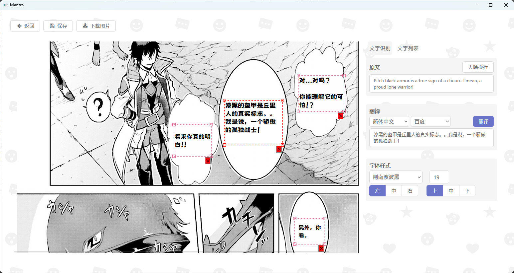

## 一、简介

> 这是一款漫画翻译软件：采用`OCR`光学图像识别对图像中的文字进行识别，再通过机械翻译回填翻译后的内容，以此实现漫画的翻译工作。

## 二、主要功能

1. 载入多张图片
2. 预览图片
3. 文字识别
4. 机器翻译
5. 回填翻译后的文字
6. 修改翻译后文字的样式
7. 下载单张图片
8. 暂存图片更改
9. 批量导出修改后的图片到指定目录（压缩成zip）

## 三、界面预览

## 四、效果预览

